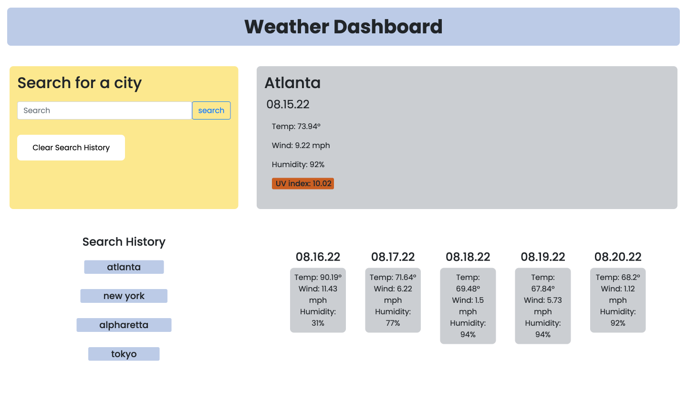

# Weather Today App
## Description
The goal of this challenge is to create an application that shows the user a weather forecast for any city that they choose. To complete this, I must use third-party API's.

## Acceptance Criteria
1. When the user searches for a city, they are given current and future weather conditions for that city, and that city is added to their search history within the app.
2. The results of each city include city name, the current date, an icon representation of weather conditions, the temperature, the humidity,  the wind speed, and the UV index.
3. The UV index is colored based on whether the conditions are favorable, moderate, or severe.
4. Each searched city includes a five-day forecast that shows the date, an icon representing weather conditions, temperature, wind speed, and humitity.
5. The user is able to click on any city in the search history and view the weather breakdown again.

## Screenshot of Application

## Deployed URL
Click [here]() for the live URL.

Click [here](https://github.com/IndigoFobes/weather-today-app) for link to Github repository.
